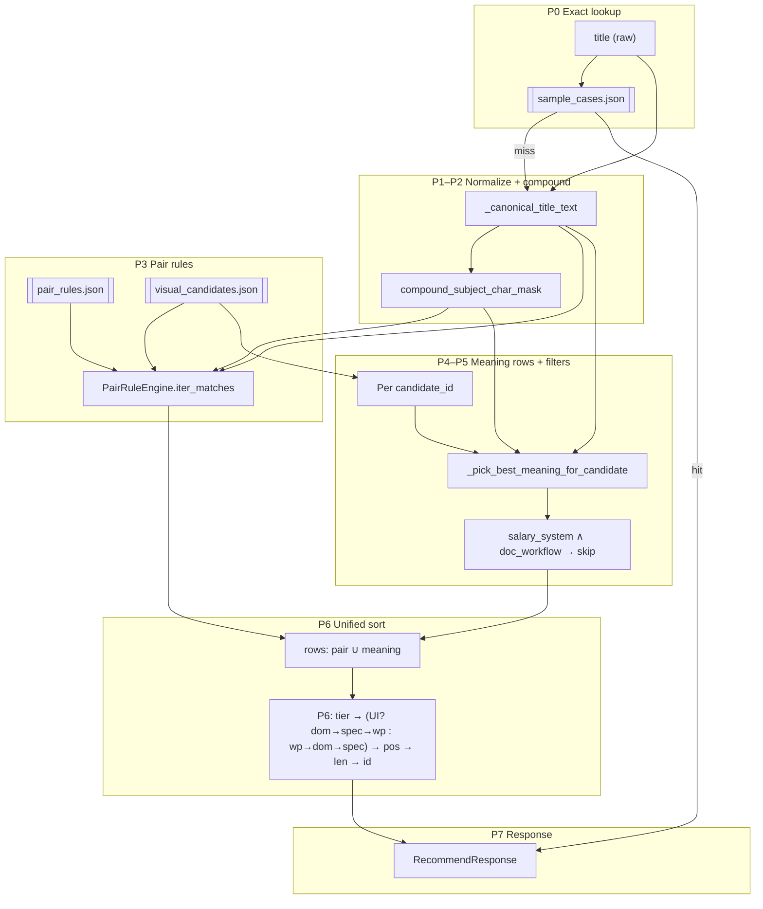

# Architecture — 실제 시맨틱 파이프라인 (코드 기준)


**경로**: `docs/ARCHITECTURE.md`. 제품 스펙·철학은 [`PRD.md`](PRD.md), [`workflow_philosophy.md`](workflow_philosophy.md), **추천 의미·workflow 계층(backbone)** 은 [`workflow_ontology.md`](workflow_ontology.md) 참고.

이 문서는 **현재 구현**(`app/main.py`, `app/data_loader.py`, `app/recommender.py`, `app/pair_engine.py`, `app/workflow_resolution.py`)의 호출 순서와 데이터 계약을 기준으로 한다.

---

## 1. 파이프라인 단계 이름 (권장 용어)

| 단계 | 구현 위치 (주) |
|------|----------------|
| **P0 — Exact case lookup** | `main.recommend_icon` → `recommender.find_exact_title_match` |
| **P1 — Title canonicalization** | `workflow_resolution._canonical_title_text` |
| **P2 — Compound span indexing** | `workflow_resolution.compound_subject_char_mask` |
| **P3 — Declarative pair resolution** | `pair_engine.PairRuleEngine.iter_matches` |
| **P4 — Meaning-based candidate expansion** | `recommender.find_best_visual_candidate_match` (루프 + `_pick_best_meaning_for_candidate`) |
| **P5 — Global candidate filtering** | 동일 함수 내 (급여·의미 없음 등) |
| **P6 — Unified ranking** | ``list[CandidateRow].sort(...)`` 단일 키 (`recommender._row_sort_key`) |
| **P7 — Visual materialization** | `main`에서 `Visual` 생성 |

“pair interpretation”은 코드에 클래스명으로 존재하지 않으며, **P3 Declarative pair resolution** + **P4에서의 meaning 매칭**으로 나누는 것이 구현과 일치한다.

### 1.1 Ontology (meaning) layer와 파이프라인

**Semantic / meaning layer:** [`workflow_ontology.md`](workflow_ontology.md) — **workflow category**, **sub workflow**, **lifecycle**, **related category**, **채널·nuance** 를 정리한 **실무 기반 recommendation meaning model**이다. **고정 taxonomy가 아니라** `feedback_log`·후보 진화·튜닝에 따라 **evolving** 한다는 전제는 ontology 문서 상단에 적혀 있다.

**목표로 하는 통합 흐름**(ontology를 **명시적 슬롯**으로 둘 때의 참조; 일부는 구현됨, 일부는 로드맵):

1. **title**  
2. **P1–P2** — canonicalization, compound span  
3. **workflow / interface 신호** — interface anchor·문서 workflow 신호 등 (`workflow_resolution`·필터와 연동)  
4. **ontology 슬라이스** — *목표:* primary category, sub-workflow, optional lifecycle stage, related categories  
5. **후보 풀** — P3 pair + P4 meaning (현재 의미는 JSON에 **분산**)  
6. **P5–P6** — 필터·랭킹  
7. **P7** — visual  
8. **feedback (observation)** — `feedback_log`에 ontology·semantic slice를 남기면 계열 내 nuance·충돌 **증거**를 쌓을 수 있음 (즉시 scoring 변경 아님)  

지금 코드에서는 **4번이 전용 모듈로 분리되어 있지 않고** P3·P4 필드에 **흡수**되어 있다. ontology 문서는 그 **meaning layer**를 읽는 backbone 역할을 한다.

---

## 2. 단계별 역할

### P0 — Exact case lookup (sample exact layer)

- **역할**: 제목이 `data/sample_cases.json`의 어떤 항목과 **공백 trim 후 문자열 완전 일치**하면, 그 레코드의 `visual`·`reason`을 그대로 반환하고 **이후 단계를 전부 생략**.
- **성격**: 사용자 truth source에 가까운 **오버라이드** — 골든 케이스·운영에서 확정한 제목→visual·회귀 테스트용 고정 답. P1 canonical·P2 compound·P3 pair·P4 meaning·P6 rank는 **호출되지 않음** (`main.recommend_icon`에서 `find_best_visual_candidate_match` 분기 자체를 타지 않음).
- **데이터 계약 (런타임)**: JSON **루트는 반드시 평면 배열** `[{...}, {...}]` 이다. 각 원소는 최소 **`title`(비어 있지 않은 문자열)** 과 **`visual`** (`type` ∈ `emoji` \| `notion_icon`, `value` 비어 있지 않음)을 가진 객체. 그 외 필드(`workflow_type`, `pair_context`, `workflow_resolution` 등)는 메타·응답 보강용으로 선택.
- **로더**: `app.data_loader.load_sample_cases()`가 파일을 읽은 뒤 `validate_flat_sample_cases`로 위 형태를 검증한다. 구버전 래퍼(`sample_case_schema`, `recommended_updates` 키)가 있으면 **즉시 `ValueError`** — 런타임이 여러 JSON 모양을 암묵적으로 흡수하지 않도록 한계를 둔다.
- **스키마 문서**: 필드 설명·예시·금지 형태는 [`sample_cases_schema.md`](sample_cases_schema.md)에만 둔다 (`sample_cases.json` 안에 스키마 객체를 넣지 않음).
- **코드 경로**: `get_sample_cases()`(모듈 캐시) → `recommender.find_exact_title_match(title, cases)` — 케이스의 `case["title"].strip()` 과 요청 `title.strip()`만 비교 (**P1 `_canonical_title_text` 미사용**).
- **테스트**: `tests/test_sample_cases.py`에서 (1) 로드된 배열의 `title`/`visual` 불변식, (2) exact 히트 시 `find_best_visual_candidate_match` 미호출, (3) 검증기의 거부 케이스를 다룬다.

### P1 — Title canonicalization

- **역할**: 비교용 문자열 `canonical` 생성 (현재는 **공백 제거** 후 연결). Pair·meaning의 substring 검사는 주로 `canonical` 기준.
- **주의**: 샘플 케이스 exact match는 **원문 `title.strip()`** 기준이므로 P1과 기준이 다름.

### P2 — Compound span indexing

- **역할**: `DOCUMENT_COMPOUND_SUBJECT_TERMS`에 해당하는 구간을 마스킹해, 그 **내부 substring**은 “문서 workflow·interface dominance 후보”로 쓰이지 않도록 함.
- **사용처**: meaning occurrence 허용 여부, interface dominance 유효화, `organize` 규칙의 subject 위치 검증.

### P3 — Declarative pair resolution (구 “pair interpretation”의 핵심)

- **역할**: generic action keyword를 subject-aware workflow로 해석한다. 즉 “정리”, “수정” 같은 행동을 단독 keyword가 아니라, (action, subject) pair로 해석한다.
실행 시에는 `data/pair_rules.json`의 prep → confirm_coordination → organize → modify 순으로, action lemma + 부가 조건이 맞으면 규칙 전용 row를 0~4개 생성한다.

- **성격**: JSON 선언형 규칙 엔진; `visual_candidates`의 `meaning` 배열 기반 keyword 매칭과는 별도 semantic track으로 동작한다.

### P4 — Meaning-based candidate expansion

- **역할**: 각 `visual_candidates` 항목(`workflow_priority` 있음, `meta` 제외)에 대해, **compound 밖에서 잡히는 meaning** 중 로컬 최선을 하나 고른 뒤 글로벌 테이블의 한 row로 올림.
- **성격**: 키워드 포함 + 위치·workflow_resolution·dominance를 row 필드로 인코딩 (정렬은 P6).

### P5 — Global candidate filtering

- **역할**: row를 만들기 **직전/직후**에 적용되는 하드 필터.
- **현재 예**: `salary_system` 후보는 제목에 문서 workflow 신호가 있으면 **행 자체를 생성하지 않음** (`title_has_document_workflow_signal`).

### P6 — Unified ranking

- **역할**: Pair에서 온 row와 meaning에서 온 row를 **한 리스트**로 모아 **단일 sort key**로 1위 선택.
- **성격**: “후보 좁히기”와 “순위 매기기”가 코드상 분리되어 있지 않고, **row 생성 → 일괄 정렬 → 첫 행** 구조.

#### organize vs modify (동시 P3 hit)

- 한 제목에 ``정리``와 ``수정``이 모두 있으면 **각각** P3에서 row가 나올 수 있다 (둘 다 `rule_tier` 동일).
- **계약**: `pair_rules.json`에서 **`modify` 규칙은 `sort_secondary_wp: 4`**, **`organize`는 `3`**을 쓴다. 제목에 UI 앵커가 없을 때 P6 키는 ``-rule_tier`` 다음에 ``-sort_secondary_wp``가 오므로, 동률이면 **modify 트랙이 organize보다 앞선다** (이후 ``interface_dominance_effective`` → ``keyword_workflow_resolution`` → …로 계속 비교).

### P7 — Visual materialization

- **역할**: 선택된 row의 `data["visual"]`를 API 응답 모델 `Visual`로 옮기고, 사람이 읽을 `reason` 문자열 구성.

---

## 3. 단계별 입력 / 출력 (contract)

### P0

| | |
|--|--|
| **입력** | `title: str`, `cases: list[dict]` — 각 dict는 런타임에서 **`title`·`visual` 필수** (로더가 검증). 선택: `reason`, `workflow_resolution`, 기타 메타 |
| **출력** | 매칭 시 해당 `dict` 전체, 없으면 `None` |
| **불변식** | P0 히트 시 **P1–P6·catalog 경로 미실행**; `main`에서 바로 `RecommendResponse` 조립 (P7의 “row에서 visual 꺼내기”가 아니라 **케이스 dict의 `visual` 직접 사용**) |
| **전제** | `data/sample_cases.json`이 평면 배열이 아니면 앱 기동 시 `load_sample_cases()` 단계에서 실패 |

### P1–P2

| | |
|--|--|
| **입력** | `key_title = title.strip()` |
| **출력** | `canonical: str`, `cov: list[bool]` (길이 = len(canonical)) |

### P3 — PairRuleEngine

| | |
|--|--|
| **입력** | `canonical: str`, `candidates: dict` (`visual_candidates` 전체) |
| **출력** | `list[PairResolution]` — prep / confirm / organize / modify 네임스페이스당 최대 1개씩 (합쳐 최대 4개) |
| **PairResolution 필드** | `data`, `candidate_id`, `matched`, `rule_tier`, `sort_secondary_wp`, `keyword_workflow_resolution`, `interface_dominance_effective` |

### P4–P6 (통합 row)

내부 표현은 ``app.candidate_row.CandidateRow`` (frozen dataclass). 의미적 필드 순은 기존 9-튜플과 동일:

`rule_tier`, `sort_secondary_wp`, `interface_dominance_effective`, `keyword_workflow_resolution`, `match_position_in_title`, `matched_keyword_length`, `matched`, `candidate_id`, `data`

- Pair 출신: ``PairResolution``을 ``_candidate_row_from_pair_resolution``으로 투영 — `match_position_in_title=0`, `matched_keyword_length=len(matched)`, `sort_secondary_wp`는 규칙 JSON 기준.
- Meaning 출신: `rule_tier=0`, `sort_secondary_wp=int(data["workflow_priority"])` (**catalog anchor strength**가 P6 슬롯으로 복사됨 — §8), 나머지는 `_pick_best_meaning_for_candidate` 산출.

P6 우승 후 API 경로로 넘길 때는 ``app.recommender.BestVisualCandidateMatch`` (NamedTuple, 기존 6-튜플과 동일한 순서·인덱싱)로 슬라이스한다.

### P7

| | |
|--|--|
| **입력** | 우승 ``CandidateRow``에서 잘린 ``BestVisualCandidateMatch`` (또는 동일 순서의 6-튜플 언팩): ``data``, ``candidate_id``, ``matched``, ``workflow_priority``, ``keyword_workflow_resolution``, ``interface_dominance_effective`` |
| **출력** | `RecommendResponse(visual, reason)` |

---

## 4. Modifier 처리 위치

| Modifier 종류 | 처리 위치 | 동작 |
|-----------------|-----------|------|
| **직책·상대 역할** (`PERSON_CONTEXT_MODIFIER_TERMS`) | **P4** `_pick_best_meaning_for_candidate` | 제목에 **compound 밖 interface anchor**가 있으면 (`title_contains_interface_anchor`), meaning 후보 풀에서 해당 키워드 매칭을 제외해 채널·도구 쪽이 이기도록 함. |
| **시간·식사 등** (점심/저녁 등) | **P4** (간접) | `meaning` 문자열의 `infer_workflow_resolution` / 리스트 내 다른 키워드와 **같은 로컬 정렬**로 경쟁; 별도 “modifier 단계” 없음. |
| **Interface anchor** | **P2 + P4** | compound 안에만 걸리면 dominance 0; 제목 전체에 anchor가 있는지는 `title_contains_interface_anchor`로 person 필터 트리거. |

정리: **modifier는 독립 파이프라인 단계가 아니라**, compound 마스크 + meaning 풀 필터 + workflow_resolution/dominance 숫자로 흡수됨.

---

## 5. `sample_cases` exact match (sample exact layer) — 위치·계약·디버깅

### 5.1 호출 순서

1. `POST /recommend-icon` → `main.recommend_icon`
2. `find_exact_title_match(body.title, get_sample_cases())`
3. 히트 시 `Visual(**case["visual"])` + `reason` 조합 후 **즉시 반환**
4. 미스 시에만 `find_best_visual_candidate_match(body.title, get_visual_candidates())` (P1–P6)

`get_sample_cases()`는 프로세스 생명주기 동안 리스트를 **한 번** 로드해 재사용한다 (`main` 모듈 전역 캐시). JSON을 바꾼 뒤 반영하려면 프로세스를 재시작해야 한다.

### 5.2 파일·모듈

| 구분 | 경로 / 심볼 |
|------|-------------|
| Truth source | `data/sample_cases.json` |
| 로드 + 구조 검증 | `app.data_loader.load_sample_cases`, `validate_flat_sample_cases` |
| 매칭 | `app.recommender.find_exact_title_match` |
| HTTP 진입점 | `app.main.recommend_icon` (P0 우선) |
| 사람이 읽는 스키마 | [`docs/sample_cases_schema.md`](sample_cases_schema.md) |

### 5.3 비교 규칙 (exact의 의미)

- **일치**: 요청 `body.title.strip()` 과 케이스 `case["title"].strip()`의 **문자열 완전 동일**.
- **비일치 예**: 전각/반각 차이, 내부 공백 개수 차이, P1에서 쓰는 **공백 제거 canonical**과는 별개 — P0는 canonical을 거치지 않는다. (나중에 정규화를 넣으려면 **P0 전용 옵션**으로 명시하는 편이 안전하다.)

### 5.4 운영·디버깅 시 체크리스트

- 추천이 catalog와 다르게 나온다면: 해당 제목이 `sample_cases.json`에 **동일 문자열**로 존재하는지 먼저 확인 (strip만 동일하면 됨).
- 기동 시 `ValueError`가 난다면: 루트가 배열인지, 래퍼 키가 없는지, 각 항목에 `title`/`visual.type`/`visual.value`가 있는지 [`sample_cases_schema.md`](sample_cases_schema.md)와 대조.

---

## 6. “Pair interpretation” 내부 sub-step (코드 매핑)

구현상 **P3 = 액션 lemma 게이트 + 규칙별 subject/채널 해석**. 아래는 책임 분리 관점의 sub-step이다.

1. **Action gate (lemma detection)**  
   각 섹션 `prep` / `confirm_coordination` / `organize` / `modify`에서 `action_lemma in canonical` 여부로 진입 (기본값: 준비 / 확인 / 정리 / 수정).

2. **Coordination / setup guard (confirm 전용)**  
   `coordination_keywords` 중 하나가 제목에 있어야 confirm 트랙 진입.

3. **Subject / channel resolution**  
   - prep: `document_subjects`, `subject_match`, `event_setup_resolution`, `food_subject_resolution`, `event_subject_resolution` 등 규칙 `type`별로 term·substring·tail 순회.  
   - confirm: `_resolve_confirm_channel`로 `channel_rules` → `candidate_id`.  
   - organize / modify: `phrase_substrings` 또는 `subject_terms_noncompound` + **compound 마스크**로 subject occurrence 검증. modify의 서면 subject 규칙은 `skip_when_interface_anchor_noncompound`로 스프레드시트·폼·에디터 등 **인터페이스 앵커가 있으면** 해당 row를 만들지 않아 P4 meaning이 interface dominance를 유지한다.

4. **Resolution packaging**  
   `PairResolution` 조립: synthetic `data`(prep/organize/modify 대부분) 또는 `visual_candidates`에서 복사한 `data`(confirm).

**구분**: 여기서는 **“제목 전체에서 generic meaning 스캔”을 하지 않음**. Generic meaning은 **P4**.

---

## 7. Candidate generation / filtering / ranking 분리 (현실 vs 이상)

### 현재 코드

- **Generation**: P3가 Pair row 생성, P4가 candidate별 meaning row 생성.  
- **Filtering**: P4 내부(의미 occurrence·person 풀), P5(`salary_system` + 문서 신호). **별도 모듈/함수 경계 없음**.  
- **Ranking**: P6 단일 `sort` — **필터 이후 생존 row 전체에 대해 전역 1순위 결정**.

### 권장 분리 (테스트·디버깅용)

- `generate_rows(title) -> list[ScoredCandidateRow]`  
- `filter_rows(rows, context) -> list[ScoredCandidateRow]`  
- `rank_rows(rows) -> ScoredCandidateRow`  
- 각 단계가 **명시적 dataclass**와 **정렬 키 튜플**을 반환하면 스냅샷 테스트가 쉬움.

---

## 8. Ranking contract — semantic vs sorting mechanics

이 절의 목적: **사람이 읽는 의미(semantic)** 와 **비교 함수가 쓰는 숫자(sorting mechanics)** 를 문서상 분리한다.  
구현은 그대로이며, 혼동의 원인은 주로 **이름이 하나인데 소스가 둘**인 경우(아래 ``sort_secondary_wp``)다.

### 8.1 차원별: semantic vs sorting

| 요소 | 주로 semantic? | 주로 sorting? | 정의 / 소스 |
|------|----------------|----------------|-------------|
| **rule_tier** | △ (트랙 메타) | ● | ``pair_rules.json``의 ``pair_rule_tier``. Meaning 행은 **0**. “규칙으로 해석된 행” vs “meaning만으로 올라온 행”을 **최상위**에서 가른다. |
| **workflow_priority** (JSON) | ● | △ | ``visual_candidates.json`` 항목 필드. 철학·PRD: **workflow 기억 anchor 강도** (1 강한 interface/workflow … 3 modifier/context). **의미 계약의 기준점**. |
| **sort_secondary_wp** (런타임) | 소스에 따라 다름 | ● | ``CandidateRow`` / ``PairResolution``의 **P6용 정수 슬롯 하나**. Meaning 행: ``int(data["workflow_priority"])``를 **그대로 복사**해 정렬에 사용. Pair 행: ``pair_rules.json``의 **별도** 키 ``sort_secondary_wp`` (예: modify 4 vs organize 3). **같은 필드명이지만 pair 쪽은 catalog 철학의 1/2/3과 동일 스케일이 아닐 수 있음**. |
| **interface_dominance_effective** | ● | ● | Meaning: occurrence·compound 반영 후 ``effective_interface_dominance_for_occurrence``. Pair: 규칙 JSON. **UI/채널 우선권**을 표현하는 **의미 신호**이며 동시에 정렬 키. |
| **keyword_workflow_resolution** | ● | ● | Meaning: workflow_resolution 추론·JSON. Pair: 규칙. modifier vs anchor 쪽 힌트; **정렬 키**. |

**정리**: “semantic만” / “sorting만” 이분법이 되는 것은 **rule_tier**(트랙 구분)와 **순수 tie-break**(위치·길이·id) 쪽에 가깝고, **dominance / workflow_resolution / catalog workflow_priority** 는 **의미를 숫자로 인코딩한 뒤 그 숫자로 비교**하는 패턴이다.

### 8.2 `workflow_priority` 단순화·이름 제안 (데이터 계약)

- **현재 (유지 권장)**: JSON 키 이름 ``workflow_priority`` — 이미 PRD·데이터·테스트 언어와 결합.
- **문서·코드 주석에서 쓸 권장 mental model** (별칭):  
  - **workflow_anchor_strength** 또는 **catalog_anchor_level** — “중요도”가 아니라 **일정 제목에서 그 workflow/interface를 떠올리는 앵커 강도** (``workflow_philosophy.md`` §9).
- **미래 마이그레이션 시** (동작 변경 없이 스키마만): ``workflow_anchor_level`` 같은 키로 rename + 호환 로더 — **이번 범위에서는 미실행**.

### 8.3 Pair tie-break vs semantic priority (``sort_secondary_wp``)

- **Meaning 트랙**: ``CandidateRow.sort_secondary_wp`` = **catalog semantic** ``workflow_priority``의 정수 복사 → P6에서 “같은 tier 안에서의 workflow 앵커 강도” 비교에 사용.
- **Pair 트랙**: ``sort_secondary_wp`` = **규칙 작성자가 정한 정렬 보조값** (같은 ``rule_tier``에서 organize vs modify 등 **네임스페이스 간 순서**). catalog의 1/2/3 철학과 **일치시키면 좋지만 필수는 아님**.

### 8.4 `CandidateRow` 필드 — 랭킹 키 관점

| 필드 | 역할 요약 |
|------|-----------|
| ``rule_tier`` | Pair vs meaning **최우선 구분**. |
| ``sort_secondary_wp`` | **통합 P6 슬롯**: meaning=anchor strength, pair=rule tie-break. |
| ``interface_dominance_effective`` / ``keyword_workflow_resolution`` | 의미 기반 비교; **제목에 UI 앵커가 있으면** 둘이 ``sort_secondary_wp`` 앞으로 당겨짐 (``recommender._row_sort_key``). |
| ``match_position_in_title`` / ``matched_keyword_length`` | 제목 내 위치·글자 수 **tie-break**; ``document_edit`` / ``document_review`` 저 dominance·저 workflow_resolution일 때 위치 비교 반전 (`_pos_key_row`). |
| ``matched`` / ``candidate_id`` / ``data`` | 근거 문자열·정체·페이로드; 마지막은 ``candidate_id`` 문자열 순. |

### 8.5 P6 실제 비교 순서 (구현 = `recommender._row_sort_key`)

정렬은 ``rows.sort`` 한 번이며, 키는 **제목 전체에 compound 밖 UI 앵커가 있는지** (`title_contains_interface_anchor`)에 따라 달라진다.

**A. UI 앵커 없음** (`title_has_ui == False`) — 키 튜플 (내림차순이라 음수 접두):

1. ``rule_tier``  
2. ``sort_secondary_wp`` (meaning: catalog anchor strength; pair: rule int)  
3. ``interface_dominance_effective``  
4. ``keyword_workflow_resolution``
5. ``match_position_in_title`` (특수 후보는 ``_pos_key_row``로 부호 조정)  
6. ``matched_keyword_length``  
7. ``candidate_id`` (문자열)

**B. UI 앵커 있음** (`title_has_ui == True`):

1. ``rule_tier``  
2. ``interface_dominance_effective``  
3. ``keyword_workflow_resolution``
4. ``sort_secondary_wp``  
5. 위치 → 길이 → ``candidate_id`` (동일)

즉 **“pair가 meaning보다 이기는가”**는 항상 1번에서 결정되고, **“같은 트랙 안에서 UI가 modifier보다 이기는가”**는 B에서 2–3번이 담당한다.

### 8.6 추천 ranking vocabulary (문서·주석 공통)

| 개념 | 권장 문서 표기 | JSON / 코드 식별자 (현재) |
|------|----------------|---------------------------|
| 규칙 트랙 부스트 | **pair tier** / **rule tier** | ``rule_tier``, ``pair_rule_tier`` |
| 카탈로그 앵커 강도 | **workflow anchor strength** / **catalog anchor level** | ``visual_candidates[].workflow_priority`` |
| P6 정수 슬롯 (통합) | **secondary rank int** (맥락에 따라 “anchor strength” 또는 “rule tie-break”) | ``CandidateRow.sort_secondary_wp`` |
| UI 신호 | **interface dominance (effective)** | ``interface_dominance_effective`` |
| 키워드 workflow 해상도 | **keyword workflow resolution** | ``keyword_workflow_resolution`` |
| 제목 내 위치 / 길이 | **match position**, **matched span length** | ``match_position_in_title``, ``matched_keyword_length`` |

**한 줄 요약**: ``rule_tier`` = **트랙(규칙 vs meaning)**; catalog ``workflow_priority`` = **의미(앵커 강도)** — meaning 행에서는 ``sort_secondary_wp``로 P6에 복사됨; pair 행의 ``sort_secondary_wp`` = **규칙 전용 tie-break**; ``interface_dominance_effective`` = **UI/채널 우선권**(B 모드에서 앵커 강도보다 앞).

---

## 9. 최소 수정 버전 (현 구조 유지)

1. **용어 고정**: 문서·주석에서 “pair interpretation” 대신 **P3 Pair rules / P4 Meaning match** 사용.  
2. **디버그 필드**: API에 `debug` 옵션(쿼리 또는 헤더)을 넣어 **정렬 전 row 상위 N개**를 JSON으로 반환 (프로덕션에서는 끔).  
3. **`RecommendResponse` 확장(선택)**: `matched_keyword`, `rule_tier`, `stage`(`sample` \| `pair` \| `meaning`) 필드 추가 — 기존 클라이언트는 무시 가능.  
4. **테스트**: `find_best_visual_candidate_match`에 **canonical + cov 고정 입력** 단위 테스트로 정렬 키 회귀 방지 (이미 `tests/test_recommender.py` 방향 유지).

---

## 10. 미래 확장 버전

1. **Generic action registry**: `action_lemma`를 하드코딩 섹션名이 아니라 `actions: [{lemma, phases: [...]}]` 형태로 일반화; P3를 플러그인 체인으로 분리.  
2. **Pair vs Meaning 통합 스키마**: 두 트랙 모두 `CandidateRow`로 정규화해 **동일 필터 파이프** 통과.  
3. **Modifier를 1급 객체로**: `ModifierExtractor` 단계를 P2–P3 사이에 두고, person/time/location 태그를 row에 붙여 필터에서 명시적으로 소비.  
4. **Observation / policy layer (후속)**: `feedback_log.json`으로 P6 이후 추천·선택·slice를 **기록**하고, 충분한 증거가 있을 때만 ontology·scoring **정책**을 검토한다 (현재는 적재·분석 경로만 부분 구현; 가중치·penalty·rerank 자동 반영 없음).  
5. **Exact match 정책 확장 (선택)**: 현재 P0는 **`strip()`만**. 필요 시 전각·연속 공백 등 **명시적 normalize 한 단계**를 `find_exact_title_match` 앞에 두되, catalog 경로(P1)와 **동일 규칙을 공유하지 않을지** 문서로 계약을 고정한다.

---

## 11. 현재 코드 기준 추천 architecture diagram



**파일 의존성 요약**

```
main.py
  ├─ get_sample_cases() → data_loader.load_sample_cases (검증된 평면 배열)
  ├─ find_exact_title_match (P0)
  └─ find_best_visual_candidate_match (P1–P6)
        ├─ workflow_resolution: canonical, compound, modifiers, dominance
        ├─ pair_engine: PairRuleEngine (P3)
        └─ visual_candidates JSON (P4–P6)
```

---

*마지막 갱신: 코드 기준 `app/` 모듈 구조와 일치하도록 작성.*
